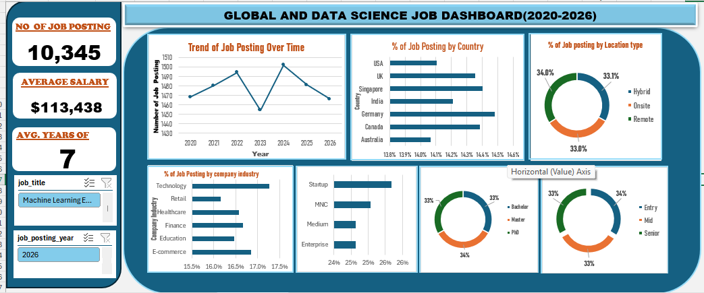

# THE ASSESSMENT OF DATA SCIENCE JOBS CHARACTERISTICS AND AVAILABILITY IN THE GLOBAL WORLD

## INTRODUCTION
This study evaluates the global landscape of data science roles from 2020 through 2026. It examines how job availability, work arrangements, sector demand, and required candidate qualifications interact to shape employment dynamics across international labor markets.

## ABOUT THE DATASET
The dataset contains 10,345 records tracking global data science positions across four key dimensions:
* **Location & Demographics:** Country (Germany, Singapore, Canada, UK, India, USA, Australia), Company Industry (Technology, E-commerce, Finance, Healthcare, Education, Retail), and Job Posting Year (2020–2026).
* **Workplace & Firm Structure:** Remote Type (Remote, Hybrid, Onsite) and Company Size (Startup, MNC, Medium, Enterprise).
* **Candidate Requirements:** Experience Level (Entry, Mid, Senior), Education Level (Bachelor, Master, PhD), Required Experience Years (Avg: 7 years), and specialized technical skills (Python, SQL, ML, Deep Learning, Cloud).
* **Economic Variables:** Annual Compensation in USD (Avg: $113,438), Hiring Urgency, and active Job Openings count.

## PROBLEM STATEMENT
To evaluate the distribution of global data science jobs, identify cross-industry hiring patterns, and determine how location flexibility and educational requirements affect talent availability and market demand.

## FINDINGS & VISUALIZATION

* **Core KPIs:** 10,345 total job postings analyzed, featuring an overall average annual salary of $113,438 and an average experience requirement of 7 years.
* **Postings Trend Over Time (2020–2026):** Demand has remained consistently high across the multi-year span, holding steady between 14.1% and 14.5% of total listings each year.
* **Work Location Distribution:** Remote roles lead at 34.0%, followed by Hybrid (33.1%) and Onsite (33.0%), reflecting an even three-way split across workplace modalities.
* **Geographic Distribution:** Job availability is spread balanced across key markets: Germany (14.5%), Singapore (14.4%), Canada (14.4%), UK (14.4%), India (14.2%), USA (14.1%), and Australia (14.1%).
* **Industry & Company Size Breakdown:** Technology leads at 17.3%, followed by E-commerce (16.9%) and Finance (16.7%). Startups account for 25.7% of listings, MNCs 25.1%, Medium firms 24.6%, and Enterprises 24.6%.
* **Experience & Education Distribution:** Entry-level positions represent 34.0%, Senior-level 33.1%, and Mid-level 33.0%. Master’s degrees are required in 34.1% of roles, PhDs in 33.1%, and Bachelor's degrees in 32.8%.

## INSIGHTS
1. **Widespread Workplace Flexibility:** Flexible work setups (Remote and Hybrid combined) represent 67.1% of all postings, confirming that non-onsite work is now standard practice in global data science roles.
2. **Global Talent Distribution:** Hiring demand shows an even geographical spread across North America, Europe, Asia-Pacific, and South Asia (~14% to 15% per region), demonstrating a decentralized international market.
3. **High Educational Entry Threshold:** Advanced degrees (Master’s or PhD) are required in 67.2% of positions, establishing a high formal educational bar for entering data roles.
4. **Cross-Sector Integration:** Demand is evenly distributed across Tech, Retail, Healthcare, Finance, E-commerce, and Education, proving that data science capabilities are critical across all economic sectors.

## RECOMMENDATION
1. **Capitalize on Cross-Border Sourcing:** Organizations facing regional talent bottlenecks should utilize the 34.0% remote infrastructure to recruit directly from broader global talent pools.
2. **Re-evaluate Formal Degree Requirements:** Employers should consider shifting focus toward demonstrated technical competencies rather than strict postgraduate degree requirements (67.2% combined) to broaden talent acquisition channels.
3. **Align Onsite Incentive Packages:** Because 67.1% of opportunities offer remote or hybrid flexibility, employers requiring fully onsite attendance must offer competitive compensation around or above the $113,438 average.
4. **Develop Structured Early-Career Programs:** With entry-level postings comprising 34.0% of available vacancies, companies should establish structured training programs to accelerate candidate progression into mid-level and senior roles.

## CONCLUSION
The global data science employment market remains strong and evenly distributed across geographic regions, company sizes, and industries through 2026. Offering competitive compensation ($113,438 average) and significant location flexibility (67.1% remote/hybrid), organizations that modernize their hiring criteria and adopt global sourcing strategies will be best positioned to attract top talent.
